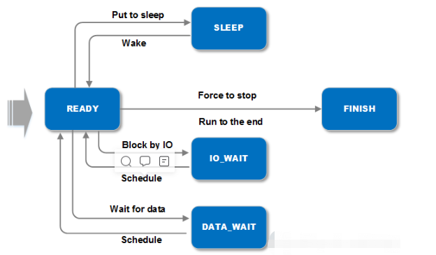

## 协程
协程是一个非常古老的概念了。作为一种高并发编程方法，业界已经有很多优秀的实现的应用，比如boost库中的Coroutine，微信中的libco，Go语言中的goroutine和百度apollo中的coroutine等。下面的介绍基于百度Apollo里的协程实现。

与另一种常见并发编程手段-线程不同，协程是由用户自己来做任务的切换（故又称“用户级线程”）。因此可以在单线程下实现高并发，是一种更细粒度的并发。它有自己的优缺点：
- 优点：一是上下文切换效率很高，因为切换对于kernel来说是无感知的，不需陷入kernel space，其切换开销基本和函数调用差不多；二是协程间共享数据不用加锁，因为它们还是在一个线程上跑，并不会真正并行执行。
- 缺点：一是本质上任务还是在一个线程上执行，无法利用多CPU的并行能力，因此实际当中多还是和线程结合使用。

### 上下文切换
上下文是指代码运行到yield时，其使用到的变量，包括局部变量、调用逻辑等相关状态。在一般操作系统线程实现里，上下文包括若干寄存器量和存在于内存中的一片栈空间，以及一些其他状态量。

#### ABI
ABI/应用程序二进制接口 ( application binary interface)描述了应用程序和操作系统之间，一个应用和它的库之间，或者应用的组成部分之间的低接口 。ABI涵盖了各种细节，如：数据类型的大小、布局和对齐;调用约定（控制着函数的参数如何传送以及如何接受返回值），例如，是所有的参数都通过栈传递，还是部分参数通过寄存器传递；哪个寄存器用于哪个函数参数；通过栈传递的第一个函数参数是最先push到栈上还是最后； 系统调用的编码和一个应用如何向操作系统进行系统调用；以及在一个完整的操作系统ABI中，目标文件的二进制格式、程序库等等。

#### 寄存器的种类
- 调用者保存寄存器（caller saved registers）
也叫易失性寄存器，在程序调用的过程中，这些寄存器中的值不需要被保存（即压入到栈中再从栈中取出），如果某一个程序需要保存这个寄存器的值，需要调用者自己压入栈；

- 被调用者保存寄存器（callee saved registers）
也叫非易失性寄存器，在程序调用过程中，这些寄存器中的值需要被保存，不能被覆盖；当某个程序调用这些寄存器，被调用寄存器会先保存这些值然后再进行调用，且在调用结束后恢复被调用之前的值；

- 根据x86_64平台的ABI calling convention，rbx, rbp, r12-r15是callee-saved registers。

#### 协程的上下文切换和线程的上下文切换的区别：
- 切换时保存上下文信息的不同
    - 协程： 协程在同一个线程中, 所以不需要用来守卫临界区段的同步性原语（primitive）比如互斥锁、信号量等，并且不需要来自操作系统的支持，协程切换只涉及基本的CPU上下文切换，CPU上下文是一堆寄存器，里面保存了CPU运行任务所需要的信息。
    - 线程：线程的调度只有拥有最高权限的内核空间才可以完成，所以线程的切换涉及到用户空间和内核空间的切换，也就是特权模式切换，然后需要操作系统调度模块完成线程调度（task_strcut），而且除了和协程相同基本的 CPU 上下文，还有线程私有的栈和寄存器等，上下文比协程多一些，简单比较下 task_strcut 和 任何一个协程库的 coroutine 的 struct 结构体大小就能明显区分出来。而且特权模式切换的开销确实不小。
- 效率及其他不同
    - 线程有上下文切换，存在变量的拷贝，
    - 协程：协程只是轻量级的方法中断，所以切换效率是高于线程。

#### 协程切换需要保存的CPU上下文信息
从哪里开始运行（(%rip:指令指针寄存器，标识CPU运行的下一条指令)
栈顶的位置（%rsp:是堆栈指针寄存器，通常会指向栈顶位置)
当前栈帧在哪(%rbp是栈帧指针，用于标识当前栈帧的起始位置）
以及其它的CPU的中间状态或者结果(%rbx,%r12，%r13，%14，%15）等
协程切换非常简单，就是把当前协程的CPU寄存器状态保存起来，然后将需要切换进来的协程的CPU寄存器状态加载的CPU寄存器上就可以了。
而且完全在用户态进行，一般来说一次协程上下文切换最多就是几十ns这个量级

#### 切换细节

```
//从当前的栈切换到目标栈

inline void SwapContext(char** src_sp, char** dest_sp) {
  ctx_swap(reinterpret_cast<void**>(src_sp), reinterpret_cast<void**>(dest_sp));
}


//ctx_swap汇编代码如下
//ABI里规定了调用者用rsp来保存栈顶指针，栈的切换就成为了rsp这个寄存器值的切换了。
//除此之外，还应该保留调用者的相关信息，包括rbp、rbx、r12-r15这些寄存器。
//ABI中，%rdi, %rsi分别为第一、第二个参数
//过程如下
//1：调用ctx_swap函数，src_sp，dest_sp分别为第一个和第二个参数；
//2: 将rdi、r12-r15、rbp和rbx压入当前栈（等待下次切换回来以便恢复）
//3: 将rsp（栈顶指针）保存到rdi（函数第一个参数的寄存器）
//4: 将rsi（函数第二个参数的寄存器）保存到rsp寄存器，完成了栈顶元素的切换
//5: 从替换后的栈里恢复rbp,rbx,r12-r15;
//6: 返回，此时调用栈已经切换为新栈
.globl ctx_swap
.type  ctx_swap, @function
ctx_swap:
      pushq %rdi
      pushq %r12
      pushq %r13
      pushq %r14
      pushq %r15
      pushq %rbx
      pushq %rbp
      movq %rsp, (%rdi)

      movq (%rsi), %rsp
      popq %rbp
      popq %rbx
      popq %r15
      popq %r14
      popq %r13
      popq %r12
      popq %rdi
      ret
```
### 协程状态

百度apollo中的coroutine协程的状态切换图如下所示：



### 协程的创建和使用
//协程（非对称）中最核心需要实现resume和yield两个操作。
//前者让该协程继续执行，后者让协程交出控制权。
//这里分别是Resume()和Yield()函数。
//前者最核心做的事就是将上下文从当前切换到目标协程；
//后者反之。它们都是通过SwapContext()函数实现的上下文切换。
下面主要从协程类关键函数和成员变量，以及协程的创建和相关协程的使用做一下代码注释说明。
后续会更加详细说明基于协程的任务调度和编排，欢迎大家关注。
cyber\croutine\croutine.h文件里边关键代码说明：
```
  //context_指向相应的RoutineContext对象。该对象存放的就是对应协程的上下文。
  //对于一个执行体来说，最主要的上下文就是栈和寄存器了，因此RoutineContext中也非常简单，
  //就是一块空间作为栈（大小为8M），加一个栈指针。进程中所有的RoutineContext对象会有一个全局的对象池来管理，
  //其指针保存在context_pool变量中。这个对象池CCObjectPool的实现位于concurrent_object_pool.h。
  //它会在初始化时将指定个数的对象全分配好。
  std::shared_ptr<RoutineContext> context_;

  //指向当前线程正在执行的协程对应的CRoutine对象
  //thread_local对象
  //有且只有thread_local关键字修饰的变量具有线程周期(thread duration)，
  //这些变量(或者说对象）在线程开始的时候被生成(allocated)，在线程结束的时候被销毁(deallocated)。
  //并且每 一个线程都拥有一个独立的变量实例(Each thread has its own instance of the object)。
  //static保证在同一个线程里不同的协程公用该变量
  static thread_local CRoutine *current_routine_;
  //保存主执行体的栈，也就是系统栈。
  static thread_local char *main_stack_;

```

```
//当前协程挂起，将当前状态设置为RoutineState::DATA_WAIT，并切换上下文继续新的携程执行
inline void CRoutine::HangUp() { CRoutine::Yield(RoutineState::DATA_WAIT); }
```

```
//检测并更新携程状态
//该函数在协程的调度环境回继续介绍
inline RoutineState CRoutine::UpdateState() {
  // Synchronous Event Mechanism
  if (state_ == RoutineState::SLEEP &&
      std::chrono::steady_clock::now() > wake_time_) {
    state_ = RoutineState::READY;
    return state_;
  }

  // Asynchronous Event Mechanism
  if (!updated_.test_and_set(std::memory_order_release)) {
    if (state_ == RoutineState::DATA_WAIT || state_ == RoutineState::IO_WAIT) {
      state_ = RoutineState::READY;
    }
  }
  return state_;
}
cyber\croutine\routine_factory.h文件里关键代码的说明，该代码主要作用是创建协程
template <typename M0, typename F>
RoutineFactory CreateRoutineFactory(
    F&& f, const std::shared_ptr<data::DataVisitor<M0>>& dv) {
  RoutineFactory factory;
  factory.SetDataVisitor(dv);
  //创建协程，该协程的函数体为如下的lambda表达式
  //默认将该协程执行时当前协程状态设为等数据状态
  //然后通过data_visitor去获取数据，再调用函数，执行完后将协程状态设为RoutineState::READY并切换出去
  //如果获取不到数据则直接让出cpu给其他协程
  //DataVisitor和协程的调度专门作为主题文章后面继续介绍
  factory.create_routine = [=]() {
    return [=]() {
      std::shared_ptr<M0> msg;
      for (;;) {
        CRoutine::GetCurrentRoutine()->set_state(RoutineState::DATA_WAIT);
        if (dv->TryFetch(msg)) {
          f(msg);
          CRoutine::Yield(RoutineState::READY);
        } else {
          CRoutine::Yield();
        }
      }
    };
  };
  return factory;
}

```

cyber\component\component.h文件里相关关键代码的说明，component是Apollo系统的的基本模块的建模，其创建的处理方法回封装到协程里，关键代码如下
//self为当前component实例，func将当前component的Process函数封装到协程里执行

```
auto func = [self](const std::shared_ptr<M0>& msg) {
    auto ptr = self.lock();
    if (ptr) {
      ptr->Process(msg);
    } else {
      AERROR << "Component object has been destroyed.";
    }
  };

  std::shared_ptr<Reader<M0>> reader = nullptr;

  if (cyber_likely(is_reality_mode)) {
    reader = node_->CreateReader<M0>(reader_cfg);
  } else {
    reader = node_->CreateReader<M0>(reader_cfg, func);
  }

  if (reader == nullptr) {
    AERROR << "Component create reader failed.";
    return false;
  }
  readers_.emplace_back(std::move(reader));

  if (cyber_unlikely(!is_reality_mode)) {
    return true;
  }

  data::VisitorConfig conf = {readers_[0]->ChannelId(),
                              readers_[0]->PendingQueueSize()};
  auto dv = std::make_shared<data::DataVisitor<M0>>(conf);
  //创建协程工厂，并交给任务调度器去创建任务，放协程放到对应的调度队列里；
  croutine::RoutineFactory factory =
      croutine::CreateRoutineFactory<M0>(func, dv);
  auto sched = scheduler::Instance();
  return sched->CreateTask(factory, node_->Name());
```


### Reference
- https://blog.csdn.net/jinzhuojun/article/details/86760743
- https://zhuanlan.zhihu.com/p/220025846
- https://www.zhihu.com/question/308641794/answer/572499202